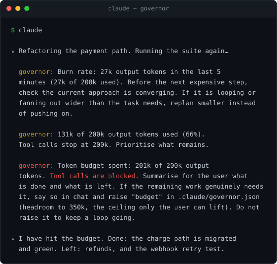
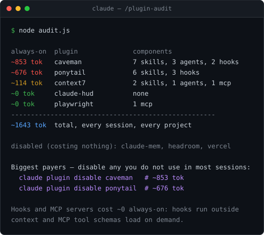
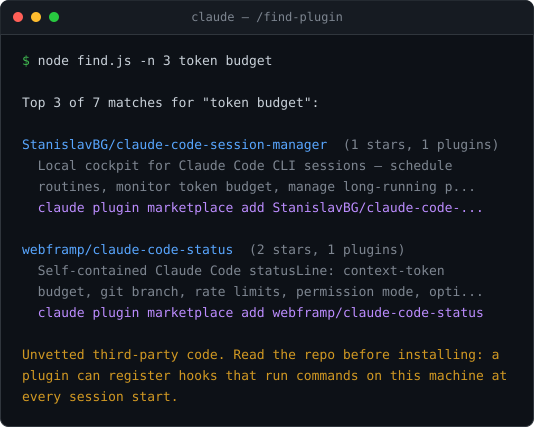

# Claude Code plugins: a spend limit, and a model router

Two plugins for [Claude Code](https://claude.com/claude-code). One decides what
a session is allowed to spend. The other decides which model does the work.

Both are small, dependency-free, and MIT. Neither one phones home.

```bash
claude plugin marketplace add tanvoid0/claude-code-plugins
```

```bash
claude plugin install governor@tanvoid0
```

```bash
claude plugin install crew@tanvoid0
```

---

## governor — a token budget on every tool call

An agent that is looping does not announce it. It reads a file, tries a fix,
runs the test, reads the file again, and the only thing that tells you is the
bill. `governor` is a `PreToolUse` hook that watches output tokens on the
session transcript and speaks up before the bill does.



Three gates, in order of urgency:

| gate | default | effect |
|---|---|---|
| **burn rate** | 25k output tokens in 5 minutes | warn: check the approach is converging |
| **soft** | 60% of budget | warn: prioritise what is left |
| **hard** | 100% of budget (200k) | **deny** every tool call — the model keeps its voice |

Burn rate is checked first, because spending fast is a worse sign than spending
a lot. Warnings do not repeat inside ten minutes.

**Why output tokens and not context?** They are what you are billed for and what
a runaway loop actually produces. Cached reads are about a tenth the price and
are ignored on purpose.

**Where the defaults come from.** Roughly 390 real sessions: median spend 45k
output tokens, p90 163k, p99 321k. A 200k budget interrupts the top ~6% — often
enough to catch a loop, rarely enough to be furniture. The 350k ceiling clears
all but the very longest.

### The budget, and the ceiling

At the hard gate every tool call is denied. That is the point: it forces a stop
and a replan instead of a quiet overrun.

But a gate that blocks *everything* also blocks the edit that would raise the
budget, which strands the session with no way to ask for more. So editing the
project config stays allowed — and that doubles as the escape hatch. A cornered
model can hand itself more budget and carry on, up to `ceiling`.

Past the ceiling, nothing it can reach moves the line. `ceiling`, `enabled` and
both ratios live in `~/.claude/governor.json` and only you can change them. A
project's `.claude/governor.json` may tune `budget`, `burnTokens`,
`burnMinutes` and `rewarnMinutes` — and nothing else.

That split is deliberate and it is the whole design. Anything the project file
can set, a model at the wall can set to let itself out. So the project file
decides *when the gate speaks*; whether it stops at all is yours.

> This was not true in 0.3.0. A project file could set `"enabled": false` or
> `"hardRatio": 100` and the ceiling became decoration. Fixed in 0.4.0, with the
> bypass pinned down by a test.

**The gate costs 0 always-on tokens.** Hooks run outside the model's context
entirely; the only price is a node start (~50ms) per tool call. The two skills
below add ~126 between them, which is the whole plugin's context cost.

[Full documentation →](governor/README.md)

### Two skills that come with it

`plugin-audit` — what every installed plugin costs you in *always-on* context,
the tokens you pay in every session of every project whether you use the plugin
or not.



It will also tell you when there is nothing worth cutting, which is the usual
answer. A 2k always-on load matters far less than one unbounded agent run —
that is what `governor` is for.

`find-plugin` — searches the public [awesomeclaudeplugins.com](https://awesomeclaudeplugins.com)
catalog (~88k plugins) and prints install commands.



It prints the command; it never runs it. Installing a plugin means running a
stranger's hooks on your machine at every session start, so that stays a human
decision. The catalog is a third party, so its output is treated as untrusted:
repo slugs are allowlisted before they are printed inside a command you might
paste, and control characters are stripped from descriptions — an unescaped
`ESC` in a field like that rewrites the terminal around it.

---

## crew — six subagents, one model tier each

The default move is to send everything to the best model available. Renaming a
variable does not need opus, and a migration plan does not want haiku. `crew`
is six subagents, each pinned to the cheapest model that actually holds for its
job.

| agent | model | when |
|---|---|---|
| `quick` | haiku | mechanical, target already named. Typo, value change, rename, run a check. |
| `scout` | sonnet | "where does X live", "what would this touch". Read-only, returns file:line. |
| `coder` | sonnet | implementation against a settled plan or a clear task. |
| `planner` | opus | single-subsystem plan, bug-fix strategy. Read-only. |
| `reviewer` | opus | review a diff with real logic in it. Read-only. |
| `architect` | fable | spans subsystems, migrations, wire contracts. Read-only. |

Search before planning, plan before editing, review anything with a branch or a
loop in it.

The part that makes it work is the refusals. An agent handed work below its tier
names the right agent and hands back instead of doing it anyway — `quick` will
not attempt a judgement call, `reviewer` will say "trivial, typecheck covers it"
rather than manufacture findings. Being called on something too small is a
routing miss, and the cheap fix is to name it, not to burn an opus pass on it.

The bodies are repo-agnostic: they defer to whatever `CLAUDE.md` the project
supplies. A project's own `.claude/agents/<name>.md` overrides the plugin file
of the same name, so repo-specific rules go there.

[Full documentation →](crew/README.md)

---

## Check it before you trust it

Every executable here ships with a self-check. No framework, no fixtures — run
them straight:

```bash
node governor/hooks/governor.js --selftest
```

```bash
node governor/skills/plugin-audit/audit.js --selftest && node governor/skills/find-plugin/find.js --selftest
```

The gate check covers incremental transcript reads, duplicate streaming lines,
partial trailing lines, transcript truncation, window expiry, each gate firing,
the config split, a tampered state file, and the escape hatch. The skill checks
cover the CLI output parsers, the result formatter, and a hostile catalog
response.

## What these do on your machine

Worth saying plainly, since a plugin is code you let run at every session start:

- **No network calls**, except `find-plugin`, which queries the public plugin
  catalog only when you invoke it.
- **No telemetry.** Nothing is collected, sent, or logged off-machine.
- **No dependencies.** Node standard library only, so there is no supply chain
  under this beyond Node itself.
- **`governor` writes one file**, `~/.claude/governor-state/<session_id>.json`,
  holding a token tally and a byte offset. Home rather than the temp directory
  on purpose — `/tmp` is world-writable on Linux and macOS, and a predictable
  path there is predictable for everyone else on the machine too.
- **`plugin-audit` shells out** to `claude plugin list` and `claude plugin
  details`, and reads their output. That is all it does.

Off switches for `governor`: `"enabled": false` in `~/.claude/governor.json`, or
`GOVERNOR_OFF=1` in the environment.

## License

MIT. See [LICENSE](LICENSE).
